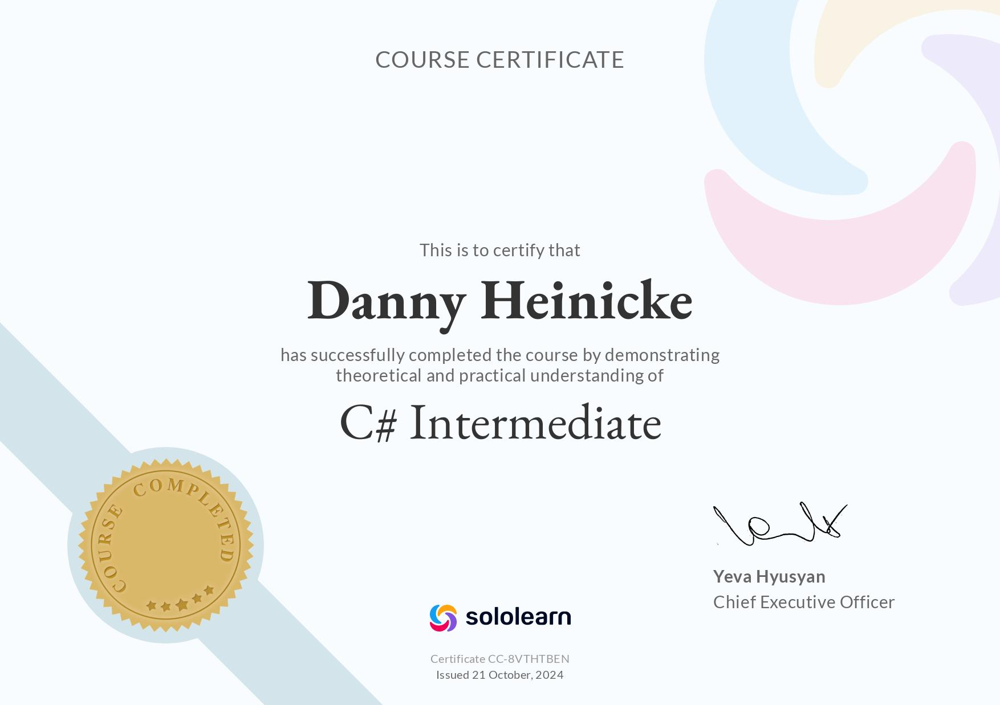

<details>
<summary><strong>### 📱 App-Projekte</strong></summary>


**🎯 Kalkulationen**
- Steuer Kalkulation html -> Thüringen '25 → [📂 Repo](#)

**⚡ .NET Maui**
- Steuer Kalkulation C# -> Thüringen '25 → [📂 Repo](#)

</details>


<details>
<summary><strong>### 🎨 Frontend Repositories</strong></summary>

| Repository | Beschreibung | Technologien | Features | Status | Link |
|------------|--------------|--------------|----------|--------|------|
| **portfolio-website** | Persönliche Portfolio-Seite | HTML, CSS, JS | Responsive Design | ✅ Live | [📂 Repo](#) |
| **react-dashboard** | Admin Dashboard Interface | React, CSS3 | Components, State Management | 🔄 In Arbeit | [📂 Repo](#) |
| **vanilla-js-projects** | Pure JavaScript Projekte | HTML, CSS, Vanilla JS | DOM Manipulation, Events | ✅ Fertig | [📂 Repo](#) |
| **css-animations** | CSS Animation Sammlung | CSS3, SCSS | Keyframes, Transitions | ✅ Fertig | [📂 Repo](#) |
| **responsive-layouts** | Responsive Design Templates | HTML, CSS, Grid/Flexbox | Mobile-First Design | ✅ Fertig | [📂 Repo](#) |
| **bootstrap-components** | Bootstrap Komponenten | Bootstrap, SCSS | Custom Components | 🔄 In Arbeit | [📂 Repo](#) |
| **vue-learning** | Vue.js Lernprojekte | Vue.js, Vuex | SPA, Routing | 🔄 In Arbeit | [📂 Repo](#) |
| **sass-styleguide** | SASS/SCSS Style Guide | SASS/SCSS | Mixins, Variables | ✅ Fertig | [📂 Repo](#) |
</details>

<details>
<summary><strong>#### 🛠️ Frontend-Tools & Utilities</strong></summary>

| Tool | Zweck | Technologie | Link |
|------|-------|-------------|------|
| **webpack-config** | Build-Konfiguration | Webpack, Babel | [📂 Repo](#) |
| **eslint-config** | Code Quality Setup | ESLint, Prettier | [📂 Repo](#) |
| **npm-scripts** | Automatisierte Tasks | NPM Scripts | [📂 Repo](#) |
</details>

<details>
<summary><strong>#### 📱 Frontend-Projekte nach Kategorie</strong></summary>


**🎯 Landing Pages**
- Modern Business Landing Page → [📂 Repo](#)
- Creative Agency Website → [📂 Repo](#)
- E-Commerce Homepage → [📂 Repo](#)

**⚡ Interactive Apps**
- Weather App (API Integration) → [📂 Repo](#)
- Todo List (Local Storage) → [📂 Repo](#)
- Quiz Application → [📂 Repo](#)

**🎨 UI/UX Experiments**
- Component Library → [📂 Repo](#)
- Design System → [📂 Repo](#)
- Animation Playground → [📂 Repo](#)

</details>
---

# 🎓 Index & Navigation - Kurse

> **Hinweis:** Diese Repository enthält Beispiele und Materialien aus meinen Kursen an der "iad" in Erfurt.  
> ⚠️ Bei einem "404 Fehler" befinden sich die Repositories möglicherweise im privaten Bereich.

## 📋 Verwendungshinweise

- ✅ **Nutzen Sie die Beispiele als Anregung**
- ❌ **Nicht als fertige Lösung verwenden**
- 🎯 **Setzen Sie sich eigene Ziele**
- 🚀 **Lernen Sie aus Fehlern**
- 💪 **Bleiben Sie am Ball**

## 🚀 Quick Start Guide

### 📋 Repository-Checkliste für neue Projekte
- [ ] README.md erstellen
- [ ] .gitignore hinzufügen
- [ ] LICENSE festlegen
- [ ] Branch-Strategie definieren
- [ ] Issues/Projects einrichten

### 🔍 Repository finden
```bash
# Alle Repositories anzeigen
git clone https://github.com/ydh-embedded/[REPO-NAME].git

# Mit GitHub CLI
gh repo list ydh-embedded
```

---
<details>
<summary><strong>## 🔗 Nützliche Online-Ressourcen</strong></summary>

| Plattform | Beschreibung | Link |
|-----------|--------------|------|
| **Udemy** | Online Video Kurse | [🌐 Zur Website](https://www.udemy.com/) |
| **SoloLearn** | Online Zertifizierung | [🌐 Zur Website](https://www.sololearn.com/de/) |
| **Readly** | Online Magazine | [🌐 Zur Website](https://de.readly.com/) |
| **W3C Validator** | HTML Validierung | [🌐 Zur Website](https://validator.w3.org/) |
| **W3C CSS Validator** | CSS Validierung | [🌐 Zur Website](https://jigsaw.w3.org/css-validator/) |
| **vTiger CRM** | Customer Relationship Management | [🌐 Zur Website](https://www.vtiger.com/de/) |
</details>

---

## 💻 C# Referenz-Tabellen

____________

  

  


____________

### 🔢 Ganzzahl-Datentypen

| Type | Prefix | .NET Framework Typ | Bits | Wertebereich |
|------|--------|--------------------|------|--------------|
| `sbyte` | - | System.SByte | 8 | -128 bis +127 |
| `byte` | - | System.Byte | 8 | 0 bis +255 |
| `char` | `c` | System.Char | 16 | U+0000 bis U+ffff |
| `short` | - | System.Int16 | 16 | -32.768 bis +32.767 |
| `ushort` | - | System.UInt16 | 16 | 0 bis +65.535 |
| `int` | `i` | System.Int32 | 32 | -2.147.483.648 bis +2.147.483.647 |
| `uint` | - | System.UInt32 | 32 | 0 bis +4.294.967.295 |
| `long` | - | System.Int64 | 64 | -9.223.372.036.854.775.808 bis +9.223.372.036.854.775.807 |
| `ulong` | - | System.UInt64 | 64 | 0 bis +18.446.744.073.709.551.615 |

### 🔢 Gleitkomma-Datentypen

| Type | Prefix | Bits | Wertebereich | Genauigkeit |
|------|--------|------|--------------|-------------|
| `float` | `f` | 32 | -3,4×10³⁸ bis 3,4×10³⁸ | 7 Stellen |
| `double` | `d` | 64 | 5×10⁻³²⁴ bis 1,7×10³⁰⁸ | 15-16 Stellen |
| `decimal` | - | 128 | -1,0×10⁻²⁸ bis +7,9×10²⁸ | 28-29 Stellen |

### ✅ Boolean-Datentyp

| Type | Prefix | Bits | Werte |
|------|--------|------|-------|
| `bool` | `b` | 8 | `true`, `false` |

---

## 🛠️ .NET Terminal-Befehle

| Befehl | Beschreibung | Beispiel-Ausgabe |
|---------|--------------|------------------|
| `dotnet --version` | Zeigt .NET Version | `8.0.401` |
| `dotnet new console --framework net8.0 --use-program-main --force` | Erstellt neue Konsolen-App | Projekt erstellt |
| `dotnet run` | Führt das Projekt aus | - |
| `dotnet build` | Kompiliert das Projekt | - |

### 🔧 MSBuild Befehle

```bash
# Rebuild mit Fehler-Logging
& 'C:\Windows\Microsoft.NET\Framework\v4.0.30319\msbuild.exe' ProjectName.csproj /t:Rebuild /fileLoggerParameters:'LogFile=Build_Errors.md;Verbosity=Diagnostic;Encoding=UTF-8'
```

---

## 📁 Projektstruktur

<details>
<summary><strong>### 🗂️ Hauptkategorien</strong></summary>

| Kategorie | Beschreibung |
|-----------|--------------|
| **Python-Compiler** | Python-Entwicklung |
| **C# Projekte** | .NET Anwendungen |
| **Markdown** | Dokumentation |
</details>

<details>
<summary><strong>📂 Vollständige Projektstruktur</strong></summary>

```
Index---Navigation/
├── 📁 Python-Compiler/
│   ├── 📄 compiler_examples.py
│   └── 📄 README.md
├── 📁 CSharp-Projects/
│   ├── 📁 Social_Network_XP35/
│   ├── 📁 Bug_Reports/
│   └── 📄 dotnet_version.md
├── 📁 Documentation/
│   ├── 📄 datatypes_reference.md
│   └── 📄 terminal_commands.md
└── 📄 README.md
```
</details>


<details>
<summary><strong>### 🎯 Hauptprojekte</strong></summary>

| Repository | Beschreibung | Technologie | Status | Link |
|------------|--------------|-------------|--------|------|
| **Index---Navigation** | Kurs-Navigation und Referenzen | Markdown | ✅ Aktiv | [📂 Repo](https://github.com/ydh-embedded/Index---Navigation) |
| **ydh-embedded** | Profil-Repository | - | ✅ Aktiv | [📂 Repo](https://github.com/ydh-embedded/ydh-embedded) |
</details>


<details>
<summary><strong>### ⚙️ Backend Repositories</strong></summary>

| Repository | Beschreibung | Technologien | Features | Status | Link |
|------------|--------------|--------------|----------|--------|------|
| **dotnet-api-core** | RESTful API mit .NET Core | C#, .NET Core, EF Core | JWT Auth, Swagger, CRUD | ✅ Fertig | [📂 Repo](#) |
| **csharp-web-api** | ASP.NET Web API Projekte | C#, ASP.NET, SQL Server | MVC Pattern, Entity Framework | 🔄 In Arbeit | [📂 Repo](#) |
| **database-integration** | Datenbank-Anbindungen | C#, MySQL, PostgreSQL | ORM, Migrations, Seeding | ✅ Fertig | [📂 Repo](#) |
| **microservices-demo** | Microservices Architektur | C#, Docker, RabbitMQ | Service Communication | 🔄 In Arbeit | [📂 Repo](#) |
| **authentication-service** | User Authentication System | C#, Identity, JWT | Login, Register, Roles | ✅ Fertig | [📂 Repo](#) |
| **file-upload-api** | File Management Service | C#, Azure Storage | Upload, Download, Validation | ✅ Fertig | [📂 Repo](#) |
| **logging-middleware** | Logging & Monitoring | C#, Serilog, Application Insights | Request Logging, Error Tracking | ✅ Fertig | [📂 Repo](#) |
| **caching-strategies** | Performance Optimization | C#, Redis, Memory Cache | Distributed Caching | 🔄 In Arbeit | [📂 Repo](#) |

</details>


<details>
<summary><strong>#### 🗃️ Datenbank-Projekte</strong></summary>

| Repository | Beschreibung | Technologie | Schwerpunkt | Link |
|------------|--------------|-------------|-------------|------|
| **sql-server-scripts** | SQL Server Datenbank Scripts | T-SQL, SSMS | Stored Procedures, Views | [📂 Repo](#) |
| **mysql-examples** | MySQL Beispiele & Übungen | MySQL, Workbench | Normalisierung, Indexing | [📂 Repo](#) |
| **mongodb-integration** | NoSQL Datenbank Integration | MongoDB, C# Driver | Document Store, Aggregation | [📂 Repo](#) |
| **database-migrations** | Migration Scripts Sammlung | EF Core, FluentMigrator | Schema Updates, Rollbacks | [📂 Repo](#) |

</details>

<details>
<summary><strong>#### 🔧 Backend-Tools & Utilities</strong></summary>


| Tool | Zweck | Technologie | Link |
|------|-------|-------------|------|
| **api-testing-collection** | Postman/Insomnia Collections | REST, GraphQL | [📂 Repo](#) |
| **docker-configurations** | Container Setup | Docker, Docker Compose | [📂 Repo](#) |
| **deployment-scripts** | Automatisierte Deployments | PowerShell, Bash | [📂 Repo](#) |
</details>

<details>
<summary><strong>#### 🏗️ Backend-Projekte nach Architektur</strong></summary>

**🎯 Monolithische Anwendungen**
- Enterprise CRM System → [📂 Repo](#)
- E-Commerce Backend → [📂 Repo](#)
- Content Management API → [📂 Repo](#)

**⚡ Microservices**
- User Management Service → [📂 Repo](#)
- Payment Processing Service → [📂 Repo](#)
- Notification Service → [📂 Repo](#)

**🔌 API Integrationen**
- Third-Party API Wrapper → [📂 Repo](#)
- Webhook Handler → [📂 Repo](#)
- Data Synchronization Service → [📂 Repo](#)

**📊 Data Processing**
- ETL Pipeline → [📂 Repo](#)
- Report Generator → [📂 Repo](#)
- Analytics Dashboard API → [📂 Repo](#)

</details>

<details>
<summary><strong>### 🎓 Kurs-spezifische Repositories</strong></summary>

| Kurs/Modul | Repository Name | Technologie | Semester | Link |
|------------|-----------------|-------------|----------|------|
| **Programmierung I** | prog1-exercises | C# | WS 2023/24 | [📂 Repo](#) |
| **Web-Entwicklung** | web-dev-projects | HTML/CSS/JS | SS 2024 | [📂 Repo](#) |
| **Datenbanken** | database-basics | SQL/MySQL | WS 2024/25 | [📂 Repo](#) |
| **Software Engineering** | software-eng | C#/.NET | SS 2025 | [📂 Repo](#) |
</details>

<details>
<summary><strong>### 🔧 Tools & Utilities</strong></summary>

| Tool | Zweck | Sprache | Typ | Link |
|------|-------|---------|-----|------|
| **Config Files** | Entwicklungsumgebung | Various | Config | [📂 Repo](#) |
| **Scripts** | Automatisierung | Bash/PowerShell | Tools | [📂 Repo](#) |
| **Templates** | Projekt-Vorlagen | Various | Templates | [📂 Repo](#) |
</details>

<details>
<summary><strong>### 📊 Repository-Statistiken</strong></summary>


```
Gesamtanzahl Repositories: [Anzahl]
Hauptsprachen: C#, Python, JavaScript, HTML/CSS
Letzte Aktivität: [Datum]
```
</details>

---

<details>
<summary><strong>## 🤝 Beitrag leisten</strong></summary>

Haben Sie Verbesserungsvorschläge oder gefunden Fehler? 
- 🐛 [Issue erstellen](../../issues)
- 🔀 [Pull Request senden](../../pulls)

</details>

---

<details>
<summary><strong>## 📞 Kontakt</strong></summary>

Bei Fragen zu den Projekten oder Kursinhalten können Sie gerne Kontakt aufnehmen.

---

*Letzte Aktualisierung: $(date)*

Feedback und Verbesserungsvorschläge sind willkommen! Öffnet gerne ein Issue oder sendet einen Pull Request.
</details>


<details>
<summary><strong>## 📄 Lizenz</strong></summary>

Dieses Repository dient Bildungszwecken. Bitte verwendet die Inhalte verantwortungsvoll.

---

**Happy Coding! 🚀**
</details>